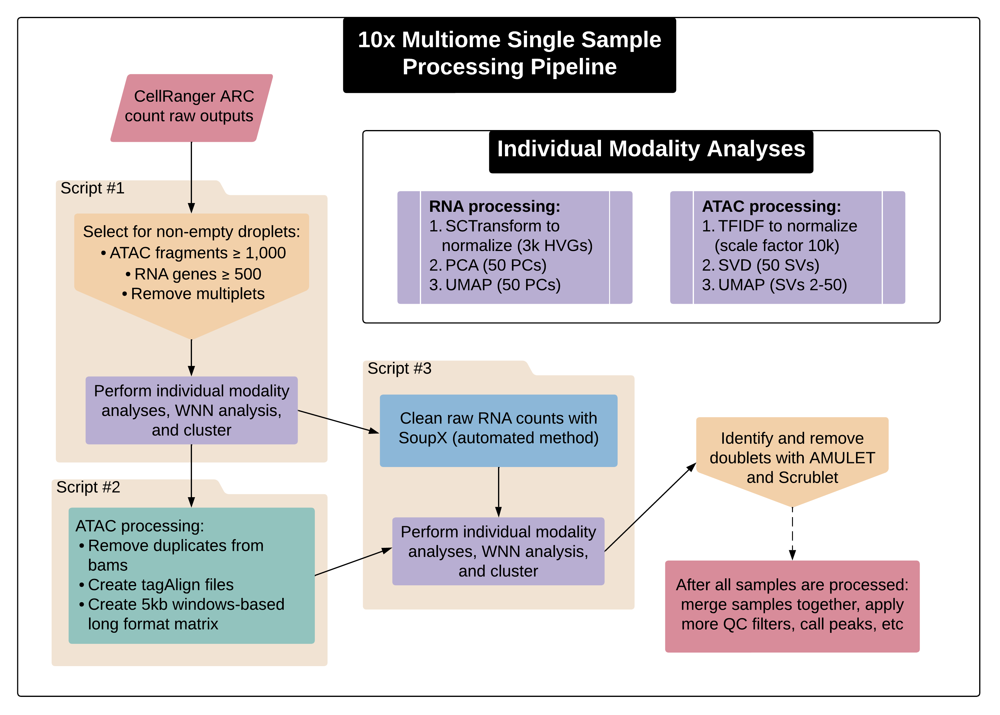

# Multiome Processing Pipeline -- Not Multiplexed
This directory contains scripts and notebooks designed to process 10X multiome data by Hannah Mummey. Please note that these scripts were designed to be run on the multiomic_islet data. However, I have tried to make them flexible so they can be used for a variety of projects, you'll just need to be careful with your inputs and change the hardcoded variables section in the bash script.



## Example Jupyter Notebook

Notebook located on lab servers at: `/nfs/lab/hmummey/multiomic_islet/notebooks/220105_Multiome_Single_Sample_Processing_Pipeline_v2_clean.ipynb`

See a [copy of the notebook](https://github.com/Gaulton-Lab/multiome-pipeline/tree/main/pipeline_v2_single_sample/220105_Multiome_Single_Sample_Processing_Pipeline_v2_clean.ipynb) in this folder as well.

## Script Information

Scripts located on lab servers at: `/nfs/lab/projects/multiomic_islet/code/indv_sample_processing`

- [Overall Bash script](https://github.com/Gaulton-Lab/multiome-pipeline/tree/main/pipeline_v2_single_sample/multiome_sample_processing_v2.sh): `multiome_sample_processing_v2.sh`
    - Inputs: -s (sample name), -d (sample data directory, where CellRanger outputs are), -r (path to reticulate conda env), -o (output dir)
    - Outputs: log file (`$outs_dir/log_file.txt`)
- [R script 1](https://github.com/Gaulton-Lab/multiome-pipeline/tree/main/pipeline_v2_single_sample/1sample_metrics_filtering_v2.R): `1sample_metrics_filtering_v2.R`
    - Inputs: `sample_dir`, `output_dir`, `rna_min_features`, `atac_min_features`, `reticulate_path`, `marker_file`
    - Outputs: `intermediate_filtered.rds`, `filtered_barcodes.txt`, `UMIs_per_BCs.png`, `intermediate_filtered_UMAPs.png`, `intermediate_filtered_metrics.png`, `intermediate_filtered_marker_genes.png`
- [Python script](https://github.com/Gaulton-Lab/multiome-pipeline/tree/main/pipeline_v2_single_sample/2ATAC_processing_v2.py): `2ATAC_processing_v2.py`
    - Inputs: —bam (`atac_possorted_bam.bam`), —fragments (`atac_fragments.tsv.gz`),  —keep (`filtered_barcodes.txt`), -outdir
    - Optional inputs (all have default settings): —threads, —memory, —mapquality, —shift, —extsize, —skip-convert, —skip-rmdup, —skip_tagalign, —skip-matrix
    - Outputs: `atac_possorted_bam.compiled.filt.bam`, `atac_possorted_bam.compiled.filt.bam`, `atac_possorted_bam.filt.md.bam`, `atac_possorted_bam.filt.rmdup.bam`, `atac_keep_reads.tagAlign.gz`, `atac_fragments.filtered_barcode.tsv.gz`, `atac_possorted_reads.filtered_barcode.bed.gz`, `atac.long_fmt.filtered_barcode.mtx`
- [R script 2](https://github.com/Gaulton-Lab/multiome-pipeline/tree/main/pipeline_v2_single_sample/3sample_postfilter_SoupX_ATACwindows_clean): `3sample_postfilter_SoupX_ATACwindows_v2.R`
    - Inputs: `sample_dir`, `output_dir`, `reticulate_path`, `marker_file`, `short_marker_file`, `soupx_marker_file`
    - Outputs: `SoupX_estimated_background.csv`, `SoupX_MarkerMaps.pngs`, `SoupX_ChangeMaps.png`, `final_filtered.rds`, `final_filtered_UMAPS.png`, `final_filtered_metrics.png`, `final_filtered_metrics_UMAP.png`, `final_filtered_marker_genes.png`, `final_filtered_marker_genes_UMAP.png`

### Overall Output Directory Example

`/nfs/lab/projects/multiomic_islet/outputs/multiome/indv_sample_processing` (Contains results made by v1 of the pipeline)

### Examples of Running the Bash Script

```bash
#run in a screen (takes ~8+ hours per sample)
cd /nfs/lab/projects/multiomic_islet/code/indv_sample_processing

### one sample
sh multiome_sample_processing_v2.sh \
-s R221 \
-d /nfs/lab/projects/multiomic_islet/data/multiomics/cellranger/deep-shallow/R221/outs$
-r /home/hmummey/.conda/envs/reticulate \
-o /nfs/lab/hmummey/multiomic_islet/intermediates/220106_multiome_pipeline_v2_tests

### multiple samples
for sample in R207 R217 R218 etc..
do
        sample_dir="/nfs/lab/projects/multiomic_islet/data/multiomics/cellranger/deep-$
        echo $sample
        echo $sample_dir
        sh multiome_sample_processing_v2.sh \
        -s $sample \
        -d $sample_dir \
        -r /home/hmummey/.conda/envs/reticulate \
        -o /nfs/lab/projects/multiomic_islet/outputs/multiome/indv_sample_processing
done
```

### Downloading Output Plots to Local Computer

Example:

```bash
sample="R207"
scp -P 1221 hmummey@sherlock.ucsd.edu:/nfs/lab/projects/multiomic_islet/outputs/multio$
scp -P 2088 hmummey@ophelia.ucsd.edu:/nfs/lab/projects/multiomic_islet/outputs/multiom$
```
